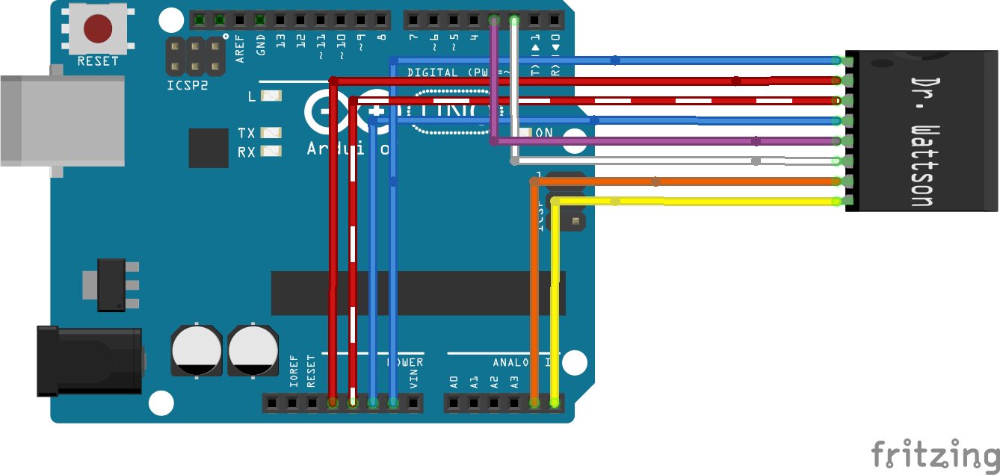

# Upbeat Labs Dr. Wattson Energy Monitoring Board Library

Arduino Library for use with *Dr. Wattson Energy Monitoring Board* or other MCP39F521 based boards with an Arduino.

Specifically designed for use with Dr. Wattson Energy Monitoring Board --> [https://www.protostax.com/products/dr-wattson-energy-monitoring-board-v2/](https://www.protostax.com/products/dr-wattson-energy-monitoring-board-v2/)

Dr. Wattson is an Energy Monitoring Breakout Board for Arduino and other Maker-Friendly Microcontrollers. Easily integrate quality AC energy measurements into your next project!

Based on the **MCP39F521**, a single-phase power monitoring chip from **Microchip**, the board is designed to be tolerant of a wide range of voltages, which means that it can also be used with the Raspberry Pi or any other 3.3v MCUs just as easily.

The unit comes pre-calibrated, enabling you to start taking quality measurements from 90-240v, at either 50 or 60 Hz, and for currents up to 15A. You don't need any additional CT/VT or other components.  With the libraries here, you can start taking measurements on the get-go with just a couple of simple commands.

If you are a more advanced user, you have a wide range of functionality available from the rich library, as well as the ability to tweak the hardware to suit your needs and recalibrate using the library.

[Learn more and get it here!](https://www.protostax.com/products/dr-wattson-energy-monitoring-board-v2/)

## Contents

* **examples/** - Example sketches for the library (.ino). Run these from the Arduino IDE
* **UpbeatLabs_MCP39F521.h**  - header file for library
* **UpbeatLabs_MCP39F521.cpp** - implementation file for library
* **library.properties** - General library properties for Arduino package manager

## Prerequisites

Refer to Dr. Wattson User Manual to set up Dr. Wattson

## Installing

Copy the entire UpbeatLabs_MCP39F521 folder under drwattson/Arduino to your Arduino libraries location.

See [Installing Additional Arduino Libraries](https://www.arduino.cc/en/Guide/Libraries#toc5) for more information if needed (under **Manual installation**)

## Usage

### Connect Dr. Wattson

See Dr. Wattson User Manual for more details.

Here is the wiring, from left to right for an Arduino Uno

* SCL to A5/D19 pin (SCL)
* SDA to A4/D18 pin (SDA)
* ZCD pin (optional) - pin 2 (external interrupt)
* Event pin (optional) - pin 3 (external interrupt)
* GND to GND pin
* Vin to 5v (Arduino Uno logic levels are based on 5v)
* 3.3v to 3.3v (power supply for the Dr. Wattson board)
* GND to GND pin

###  I2C connection
You'll need to configure the solder jumpers on the Dr. Wattson board to set the I2C address you'd like to use. See Dr. Wattson User Manual for more details.

[Note: you can configure the addressing using two solder jumpers on the board, for a total of 4 possible combinations (that correspond to addresses of 0x74, 0x75, 0x76 or 0x77). This means that you can connect up to 4 Dr. Wattson boards using a single MCU]

## Examples

Once the library is installed, you can navigate to the example sketches from your Arduino IDE and open them up to compile and run. 

* **GetEnergyData** - "Hello World" example to get metering data from your Dr. Wattson, including Voltage RMS, Current RMS, Power Factor, Active Power, Reactive Power with a simple call
* **EEPROMExample**	- 	Write to and read from 512 bytes of EEPROM memory available on MCP39F521  (organized as 32 pages of 16 bytes each)	
* **EventExample** - Get event callback interrupt notifications for different conditions like Voltage Sag (for example Power outage), Voltage Surge, Over Current  and Over Power over specified thresholds
* **EnergyAccumulationExample** - Turn on the energy accumulator to get cumulative energy consumption for Active and Reactive Energy

## License

A lot of time and effort has gone into providing this open source library. Please support Upbeat Labs by purchasing products from Upbeat Labs!

Written by Sridhar Rajagopal for Upbeat Labs. BSD license, all text above must be included in any redistribution
