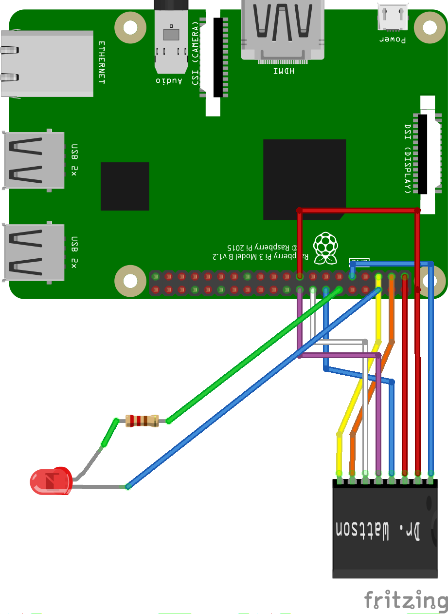

## Python Library for Upbeat Labs Dr. Wattson board (and MCP39F521)

Python library to use with *Dr. Wattson Energy Monitoring Board* or other MCP39F521 based boards with a Raspberry Pi (or Beaglebone Black).

Specifically designed for use with Dr. Wattson Energy Monitoring Board --> [https://www.protostax.com/products/dr-wattson-energy-monitoring-board-v2/](https://www.protostax.com/products/dr-wattson-energy-monitoring-board-v2/)

Dr. Wattson is an Energy Monitoring Breakout Board for Arduino and other Maker-Friendly Microcontrollers. Easily integrate quality AC energy measurements into your next project!

Based on the **MCP39F521**, a single-phase power monitoring chip from **Microchip**, the board is designed to be tolerant of a wide range of voltages, which means that it can also be used with the Raspberry Pi or any other 3.3v MCUs just as easily.

The unit comes pre-calibrated, enabling you to start taking quality measurements from 90-240v, at either 50 or 60 Hz, and for currents up to 15A. You don't need any additional CT/VT or other components.  With the libraries here, you can start taking measurements on the get-go with just a couple of simple commands.

If you are a more advanced user, you have a wide range of functionality available from the rich library, as well as the ability to tweak the hardware to suit your needs and recalibrate using the library.


[Learn more and get it here!](https://www.protostax.com/products/dr-wattson-energy-monitoring-board-v2/)

## Prerequisites

Enable I2C on the Raspberry Pi

Refer to Dr. Wattson User Manual to set up Dr. Wattson

## Installing

```
sudo python -m pip install --upgrade setuptools wheel
sudo pip install UpbeatLabs_MCP39F521 --upgrade
```
Or alternatively:

```
sudo python -m pip install --upgrade setuptools wheel
git clone https://github.com/upbeatlabs/drwattson.git
cd drwattson/Python
sudo python setup.py install
```

## Usage

### Connect Dr. Wattson

See Dr. Wattson User Manual for more details.



Here is the wiring, from left to right

* SCL to RPI (physical) pin 5 (SCL)
* SDA to RPI (physical) pin 3 (SDA)
* ZCD pin (optional) - RPI (physical) pin 16 (GPIO23) (or any available GPIO pin)
* Event pin (optional) - RPI (physical) pin 18 (GPIO24) (or any available GPIO pin)
* GND to RPI (physical) pin 14 (GND)
* Vin to RPI (physical) pin 1 (3.3v)
* 3.3v to RPI (physical) pin 17 (3.3v)
* GND to RPI (physical) pin 9 (GND)

Optionally, 
* connect LED Anode to RPI (physical) pin 12 (GPIO18) (or any available GPIO pin) via 220 ohm resistor
* connect LED Cathode to RPI (physical) pin 6 (GND)

### Test I2C connection
You'll need to configure the solder jumpers on the Dr. Wattson board to set the I2C address you'd like to use. See Dr. Wattson User Manual for more details.

Use i2cdetect -y 1 to test the connection.

[Note: you can configure the addressing using two solder jumpers on the board, for a total of 4 possible combinations (that correspond to addresses of 0x74, 0x75, 0x76 or 0x77). This means that you can connect up to 4 Dr. Wattson boards using a single MCU]

```
pi@raspberrypi:~ $ i2cdetect -y 1
0  1  2  3  4  5  6  7  8  9  a  b  c  d  e  f
00:          -- -- -- -- -- -- -- -- -- -- -- -- --
10: -- -- -- -- -- -- -- -- -- -- -- -- -- -- -- --
20: -- -- -- -- -- -- -- -- -- -- -- -- -- -- -- --
30: -- -- -- -- -- -- -- -- -- -- -- -- -- -- -- --
40: -- -- -- -- -- -- -- -- -- -- -- -- -- -- -- --
50: -- -- -- -- -- -- -- -- -- -- -- -- -- -- -- --
60: -- -- -- -- -- -- -- -- -- -- -- -- -- -- -- --
70: -- -- -- -- 74 -- -- --
```

### Run Examples

See example code under the  **examples/** directory
See comments in each example for more details on setup

```
cd examples
python getEnergyData.py
```

## License

A lot of time and effort has gone into providing this open source library. Please support Upbeat Labs by purchasing products from Upbeat Labs!

Written by Sridhar Rajagopal for Upbeat Labs. BSD license, all text above must be included in any redistribution
